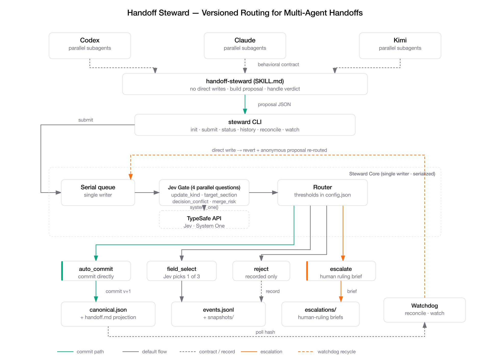

<div align="center">
  
  <h1>Handoff Steward</h1>
  <p><strong>Version-managed routing for multi-agent handoff documents.</strong><br/>
  Jev (TypeSafe System One) makes the semantic judgments. Code owns the version mechanics.</p>
  <p>
    <a href="https://github.com/yizhiyanhua-ai/fireworks-routing-lab/actions/workflows/ci.yml"></a>
    <a href="LICENSE"></a>
    =3.11"/>
    
  </p>
  <p><a href="README.zh.md">中文文档</a></p>
</div>

---

## The problem

You run a large goal across several AI coding tools — Codex, Claude, Kimi — and each of
them spawns parallel subagents. They all share handoff documents to stay aligned. Under
high-frequency concurrent updates, those documents degrade fast: lost updates,
contradictory decisions recorded side by side, no idea which version is canonical.

Handoff Steward sits **in front of every handoff write** as a single-writer gateway.
Tools never edit the document directly; they submit *update proposals*. The steward
serializes them, asks Jev to judge each proposal semantically, and routes it:
auto-commit, field-level merge, rejection, or escalation to a human.

## Architecture



[SVG source](docs/handoff-steward-arch-en.svg) — OpenAI Official style

The complete system = **skill (behavioral contract) + CLI (the only write path) +
Steward Core (serialization + Jev semantic routing) + versioned store + watchdog reconcile**:

- Parallel subagents of all tools follow the skill contract and submit proposals via the CLI
- Steward Core absorbs reordering; the Jev Gate asks 4 questions in one parallel call;
  the Router maps answers to one of four verdicts
- `auto_commit` writes canonical + event log; `escalate` writes a brief for a human;
  the watchdog reverts any direct write and recycles it as an anonymous proposal

## Why Jev only judges, never writes

Merge mechanics (diff, three-way, serialization, locking) are deterministic code —
that is where correctness lives. Jev answers the questions code cannot:
*"Does this proposal contradict decision D-1?"*, *"Is this stale proposal still
applicable?"*, *"Which candidate value should win?"* — returned as typed answers
with probabilities and confidence. Typed output guarantees the interface, not the
truth; calibration against your own data is what the test matrix is for.

## Install — just ask your agent

The intended way to install Handoff Steward is **one natural-language sentence** to
Claude Code, Codex, or any agent with shell access:

> **EN:** "Clone https://github.com/yizhiyanhua-ai/fireworks-routing-lab, follow its README to install the `handoff-steward` CLI, run `install-skill` so you and my other tools get the skill, then run `doctor --live` to verify. Ask me for the TypeSafe API key when needed."

> **中文：** “克隆 https://github.com/yizhiyanhua-ai/fireworks-routing-lab 并按 README 装好 handoff-steward CLI，运行 install-skill 把你和其他工具的 skill 装上，最后跑 doctor --live 验证。需要 TypeSafe API key 时找我要。”

The agent will: clone → `pip install .` → `handoff-steward install-skill`
(detects `~/.claude/skills`, `~/.codex/skills`, `~/.agents/skills`, `~/.pi/agent/skills`)
→ ask you for `TYPESAFE_API_KEY` → `handoff-steward doctor --live` to prove the setup.
From then on, every agent that discovers the skill automatically routes handoff writes
through the gateway — that discovery *is* the integration.

## Quick start (manual)

```bash
pip install .            # or: pip install handoff-steward
export TYPESAFE_API_KEY=...   # from https://console.typesafe.ai/settings/keys

handoff-steward install-skill   # ship the behavioral contract to your agents
handoff-steward doctor --live   # verify: key set, skill installed, Jev reachable

# initialize a store for one goal
handoff-steward --root ./stores/goal-1 init --goal-id goal-1 --goal "Ship the video pipeline"

# agents submit proposals instead of editing handoff.md
handoff-steward --root ./stores/goal-1 submit --proposal examples/proposals/append-decision.json

handoff-steward --root ./stores/goal-1 status
handoff-steward --root ./stores/goal-1 history
handoff-steward --root ./stores/goal-1 watch --interval 5   # watchdog mode
```

> Behind a SOCKS proxy (`ALL_PROXY=socks5://...`), install with `pip install .[socks]`.

## Proposal format

```json
{
  "author_tool": "claude",
  "author_ref": "claude:session-abc:subagent-3",
  "base_version": 3,
  "section": "decisions",
  "operation": "append",
  "content": {"text": "State storage uses PostgreSQL"},
  "summary": "Record architecture decision: PostgreSQL"
}
```

| Field | Meaning |
|---|---|
| `author_tool` | Who you are: `codex` / `claude` / `kimi` / `pi` / `external` |
| `author_ref` | Optional fine-grained identity. **Required under concurrency** for traceability |
| `base_version` | The canonical version the proposal was computed from (stale bases are re-gated) |
| `section` | `goal` / `current_state` / `decisions` / `open_questions` / `next_actions` / `evidence_log` |
| `operation` | `append` / `update` (updating a decision supersedes it) |
| `content` | String for text sections; `{"text": ...}` for decisions; `{"id": "D-1", "text": ...}` to supersede |
| `summary` | One-line statement of intent — read by Jev and by humans |

## The routing table

Every proposal gets one parallel Jev call: `update_kind` (Choice), `target_section`
(Choice), `decision_conflict` (Noul fan-out per overlapping decision), `merge_risk`
(Score). Then the routing table decides:

| Condition | Verdict |
|---|---|
| `update_kind = unrelated` | **reject** |
| stale base and `still_applies < 0.5` | **reject** |
| any `decision_conflict p > 0.6` | **escalate** |
| any decisive `confidence < 0.5` | **escalate** |
| `merge_risk ≤ 0.5` | **auto_commit** |
| `merge_risk ≤ 1.5` | **field_select** (Jev picks: accept / keep existing / human) |
| `merge_risk > 1.5` | **escalate** |

Thresholds live in `<store>/config.json` — tune them against your own data.

## MCP & hooks: native integration with coding agents

Beyond the CLI+skill contract, the steward plugs directly into agent runtimes:

```bash
pip install ".[mcp]"            # MCP server dependencies
handoff-steward install-mcp      # register with Claude Code, Codex, Cursor, Gemini
handoff-steward install-hooks    # Claude Code: PreToolUse guard + SessionStart context;
                                 # Cursor: afterFileEdit reconcile
handoff-steward doctor --mcp     # verify registrations
```

- **MCP tools**: `submit_proposal`, `get_status`, `get_history`, `list_escalations`, `init_store`
  — agents submit without touching the shell at all
- **guard (PreToolUse)**: denies direct Write/Edit into any store and points the agent at
  `submit` — the preventive enforcement layer (mode 4)
- **SessionStart**: injects store state (version, active decisions, pending escalations)
  into every new session automatically
- **file-changed (Cursor `afterFileEdit`)**: post-write reconcile for agents without
  a blocking pre-edit hook

## Self-built agents (LangGraph, Agents SDK, AutoGen, …)

Teams running their own coding agent on an open-source framework mount
`handoff-steward-mcp` through the framework's MCP client — no shell wrapper needed:

```python
# LangGraph / LangChain
from langchain_mcp_adapters.client import MultiServerMCPClient
client = MultiServerMCPClient({
    "handoff-steward": {"transport": "stdio", "command": "handoff-steward-mcp", "args": []}
})
tools = await client.get_tools()   # submit_proposal, get_status, …
```

```python
# OpenAI Agents SDK
from agents.mcp import MCPServerStdio
steward = await MCPServerStdio(name="handoff-steward",
    params={"command": "handoff-steward-mcp", "args": []}).__aenter__()
```

Works the same for AutoGen (`McpWorkbench`), CrewAI, Pydantic AI and smolagents.
Deeper still, Python agents can skip MCP entirely and use the library API:
`from steward import Steward, Proposal` — inject your own `TypeSafeClient`, tune
`config.json` thresholds, read `history()` for team audit.

Deployment note: the store lock is `flock` (single-machine semantics) and MCP runs
over stdio, so run the agent fleet and the store on one host. `author_ref` is
self-declared — trusted-team scope, not multi-tenant.

## Beyond multi-tool: three scenarios

The same mechanism serves a single coding agent's own workflow. Steward's version
mechanics guarantee *state* truth; Jev's semantic judgments guard *content* truth.

**1. Session → session handoff.** A store becomes a living document across sessions of
one tool: the next session opens with the current version, open questions and pending
escalations already injected (SessionStart hook). When the new session unknowingly
contradicts a decision made three sessions ago, `decision_conflict` catches it instead
of silently writing it in. Full event log = complete archaeology of every shift change.
[Recipe](examples/recipes/session-handoff.md)

**2. Subagent result reporting.** Five parallel subagents stop reporting prose to a
lead agent that hand-summarizes; each submits directly to the steward. Aggregation
becomes deterministic collection + Jev contradiction detection — when subagent-1 says
"the API streams" and subagent-2 says "it doesn't", you get an escalation brief with
both evidence links, not an averaged half-truth. `author_ref` keeps every claim
traceable. [Recipe](examples/recipes/subagent-reporting.md)

**3. A shared decision log with teeth.** The `decisions` section is a runtime-enforced
ADR system: every new decision is fan-out checked against all active ones; contradictions
escalate to you with a side-by-side brief; superseded decisions keep their full text,
so you can always answer "when, by whom, and replaced by what". Cross-tool *and*
cross-session. [Recipe](examples/recipes/decision-log.md)

## Usage modes

The CLI is always the only write path — the modes differ only in *who calls it and when*.

### 1. Skill-driven (primary): agents route themselves

Dispatch a subagent with one sentence; the skill handles the rest:

> "When done, update the handoff (store: `~/work/.handoff/goal-video-pipeline`) following the handoff-steward skill. Your author_ref is `claude:session-main:subagent-2`."

The subagent autonomously: `status` → builds a proposal with the current version →
`submit` → Jev routes it. A sibling subagent submitting at the same moment is
serialized by the flock, re-gated via `still_applies`, and lands as the next version.
Zero lost updates.

### 2. Manual CLI: working an escalation

```bash
handoff-steward --root <store> history | grep escalation   # find it
cat <store>/escalations/esc-*.json                         # read the brief (both sides + Jev reasoning)
# you rule: keep D-1 (PostgreSQL), allow a MongoDB read replica for reporting
handoff-steward --root <store> submit --proposal ruling.json   # summary: "human ruling: ..."
```

### 3. Watchdog: catching direct writes that bypass the skill

```bash
nohup handoff-steward --root <store> watch --interval 5 > /tmp/steward-watch.log 2>&1 &
# a rogue subagent edits canonical.json directly → watchdog log:
# {"external_write": true, "recovered": 1, "results": [{"action": "auto_commit", ...}]}
```

The direct write is reverted, its content re-enters as an anonymous proposal and must
pass the same Jev gate — bypassing earns no privilege; contradictions still escalate.
An `external_write_detected` event stays in the log for accountability.

### 4. Hook interception (prevention, not yet enabled)

For hard compliance, a PreToolUse hook can reject `Write`/`Edit` calls targeting any
handoff store and point the agent at `handoff-steward submit` — the only *preventive*
enforcement. Requires a new `guard` subcommand and per-tool hook wiring (Claude /
Codex / Kimi differ). Modes 1+3 cover daily use; mode 4 is reserved for strict setups.

## Concurrency model

Cross-tool and same-tool (multiple sessions × subagents) look identical to the
steward: concurrent proposal submitters.

- Serialization is an **OS-level flock** on `<store>/.steward.lock`, shared by
  `submit` and `reconcile` — version check, Jev gating and commit can never interleave
- Late submitters with stale `base_version` are re-gated via `still_applies`;
  if their change is still valid it lands normally — no lost updates
- The handoff document is a **projection** of an append-only event log plus
  content-addressed snapshots: every action is traceable, rollback is free

## Fail-closed degradation

If the Jev API is unreachable or errors, the proposal is **escalated to a human with
a written brief** — never auto-committed, never silently dropped. The system degrades
to "serialize everything, humans decide", never to "everyone writes directly".

## Testing

```bash
# offline unit tests — no API key needed
pip install .[dev] && pytest tests/test_offline.py

# live integration (requires TYPESAFE_API_KEY)
python tests/live_routing_matrix.py   # 10 routing cases against live Jev
python tests/live_concurrent.py       # 6 processes, same base_version, zero lost updates
```

Latest local run: **10/10 routing matrix PASS**, **5/5 concurrency checks PASS**
(decision-conflict detection at p=0.98, stale re-gating at 0.57–0.69).

## Project layout

```
steward/            # the package: schema, store, jev_gate, router, steward, watchdog, lock,
                    # install (skill installer + doctor), cli
steward/assets/     # the bundled agent skill (installed by `install-skill`)
tests/              # offline unit tests + live integration suites
examples/proposals/ # ready-to-submit proposal JSON
docs/               # logo, architecture diagram (SVG + PNG)
```

## Contributing

Issues and PRs welcome. Please run `pytest tests/test_offline.py` before submitting;
if your change touches routing behavior, add a case to `tests/live_routing_matrix.py`
and declare its expected verdict up front.

## License

[MIT](LICENSE)
