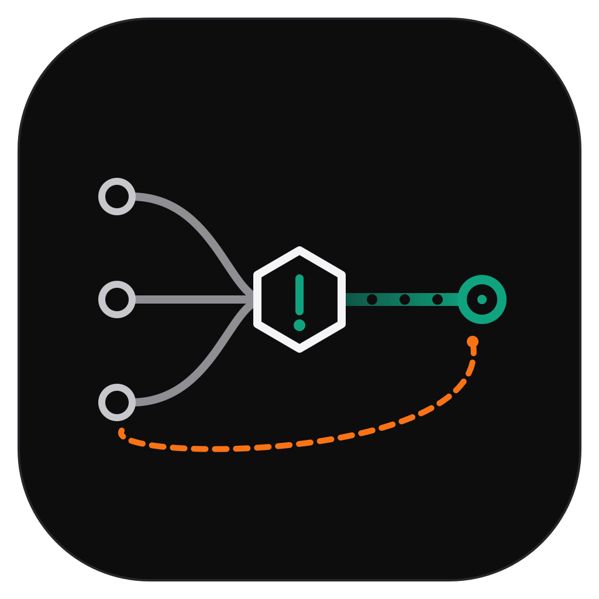
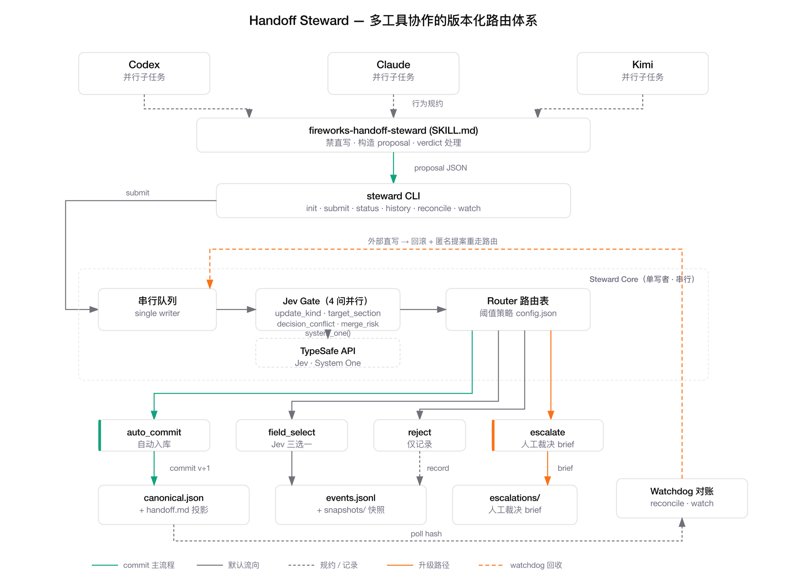

<div align="center">
  
  <h1>Handoff Steward</h1>
  <p><strong>多智能体 handoff 文档的版本化管理路由。</strong><br/>
  Jev（TypeSafe System One）负责语义判断，代码负责版本机制。</p>
  <p>
    <a href="LICENSE"></a>
    =3.11"/>
    
  </p>
  <p><a href="README.md">English</a></p>
</div>

---

## 要解决的问题

你在多个 AI 编程工具（Codex、Claude、Kimi）之间推进一个大目标，每个工具还会派生
并行子任务。大家靠共享 handoff 文档对齐上下文。在高频并发更新下，文档很快失控：
更新丢失、矛盾决策并存、谁也不知道哪个版本才是真的。

Handoff Steward 挡在**每一次 handoff 写入之前**，作为单写者网关。工具不再直接编辑
文档，而是提交「更新提案」。Steward 串行处理这些提案，让 Jev 对每个提案做语义判断，
然后路由到四种结果之一：自动入库、字段级合并、驳回、升级人工。

## 体系架构



[SVG 源文件](docs/handoff-steward-arch.svg)（OpenAI Official 风格）

完整体系 = **skill（行为规约）+ CLI（唯一写入通道）+ Steward Core（串行 + Jev 语义路由）
+ 版本化存储 + Watchdog 对账**：

- 三个工具的并行子任务受 skill 规约，构造 proposal 经 CLI 提交
- Steward Core 吸收乱序；Jev Gate 一次调用 4 问并行判断；Router 按阈值路由 verdict
- `auto_commit` 写 canonical + 事件日志；`escalate` 写 brief 等人裁；
  watchdog 把外部直写回滚并回收为匿名提案重走路由

## 设计原则：Jev 只判断，不写作

合并机制（diff、three-way、串行化、锁）是确定性代码——正确性在那里。Jev 只回答
代码回答不了的问题：*「这个提案和决策 D-1 矛盾吗？」「过时提案现在还有效吗？」
「两个候选值该选哪个？」*——以带概率和置信度的类型化答案返回。类型化输出保证的是
接口而不是真相；针对你自己的数据做校准，正是测试矩阵存在的意义。

## 安装——对你的 agent 说一句话

推荐的安装方式是**一句自然语言**，说给 Claude Code、Codex 或任何有 shell 权限的 agent：

> “克隆 https://github.com/fireworks/handoff-steward 并按 README 装好 handoff-steward CLI，运行 install-skill 把你和其他工具的 skill 装上，最后跑 doctor --live 验证。需要 TypeSafe API key 时找我要。”

> **EN:** "Clone https://github.com/fireworks/handoff-steward, follow its README to install the `handoff-steward` CLI, run `install-skill` so you and my other tools get the skill, then run `doctor --live` to verify. Ask me for the TypeSafe API key when needed."

agent 会依次执行：克隆 → `pip install .` → `handoff-steward install-skill`
（自动探测 `~/.claude/skills`、`~/.codex/skills`、`~/.agents/skills`、`~/.pi/agent/skills`）
→ 向你要 `TYPESAFE_API_KEY` → `handoff-steward doctor --live` 自检通过。
此后，每个能发现这个 skill 的 agent 都会自动把 handoff 写入改道到网关——
**skill 的发现本身就是集成**，不需要改任何工具的配置。

## 快速开始（手动）

```bash
pip install .            # 或：pip install handoff-steward
export TYPESAFE_API_KEY=...   # 从 https://console.typesafe.ai/settings/keys 获取

handoff-steward install-skill   # 把行为规约分发给各个 agent
handoff-steward doctor --live   # 自检：key 已配置、skill 已安装、Jev 可达

# 为一个 goal 初始化 store
handoff-steward --root ./stores/goal-1 init --goal-id goal-1 --goal "交付视频管线"

# agent 提交 proposal，而不是直接编辑 handoff.md
handoff-steward --root ./stores/goal-1 submit --proposal examples/proposals/append-decision.json

handoff-steward --root ./stores/goal-1 status
handoff-steward --root ./stores/goal-1 history
handoff-steward --root ./stores/goal-1 watch --interval 5   # watchdog 常驻模式
```

> 走 SOCKS 代理（`ALL_PROXY=socks5://...`）时，用 `pip install .[socks]` 安装。

## Proposal 格式

```json
{
  "author_tool": "claude",
  "author_ref": "claude:session-abc:subagent-3",
  "base_version": 3,
  "section": "decisions",
  "operation": "append",
  "content": {"text": "状态存储统一用 PostgreSQL"},
  "summary": "记录架构决策：PostgreSQL"
}
```

| 字段 | 说明 |
|---|---|
| `author_tool` | 你是谁：`codex` / `claude` / `kimi` / `pi` / `external` |
| `author_ref` | 可选细粒度身份。**并发场景必填**，用于溯源和升级排查 |
| `base_version` | 提案基于的 canonical 版本（过时基线会被重新门控） |
| `section` | `goal` / `current_state` / `decisions` / `open_questions` / `next_actions` / `evidence_log` |
| `operation` | `append` / `update`（update 决策 = 废止旧决策） |
| `content` | 文本区用字符串；decisions 用 `{"text": ...}`；废止用 `{"id": "D-1", "text": ...}` |
| `summary` | 一句话意图说明，Jev 和人都看 |

## 路由表

每个提案触发一次并行 Jev 调用：`update_kind`（Choice）、`target_section`（Choice）、
`decision_conflict`（对每个重叠决策的 Noul fan-out）、`merge_risk`（Score）。
然后路由表裁决：

| 条件 | 结果 |
|---|---|
| `update_kind = unrelated` | **reject** |
| 基线过时且 `still_applies < 0.5` | **reject** |
| 任一 `decision_conflict p > 0.6` | **escalate** |
| 任一关键 `confidence < 0.5` | **escalate** |
| `merge_risk ≤ 0.5` | **auto_commit** |
| `merge_risk ≤ 1.5` | **field_select**（Jev 三选一：采用 / 保留 / 人工） |
| `merge_risk > 1.5` | **escalate** |

阈值在 `<store>/config.json`，请按你的真实数据校准。

## 四种使用模式

CLI 永远是唯一写入通道，模式的区别只在于「谁来调、什么时机调」。

### 1. Skill 驱动（主模式）：agent 自主走网关

派 subagent 时一句话即可，skill 会接管细节：

> “完成后更新 handoff（store: `~/work/.handoff/goal-video-pipeline`），遵循 handoff-steward skill，你的 author_ref 是 `claude:session-main:subagent-2`。”

subagent 自主执行：`status` 读版本 → 构造 proposal → `submit` → Jev 路由。
同一时刻另一个 subagent 也在提交 → flock 串行 → stale 重检 → 作为下一版本正常入库，
零丢更新。

### 2. CLI 手动：处理 escalate 裁决

```bash
handoff-steward --root <store> history | grep escalation   # 找到它
cat <store>/escalations/esc-*.json                         # 读 brief（冲突双方 + Jev 理由）
# 你裁决：维持 D-1（PostgreSQL），报告模块允许 MongoDB 只读副本
handoff-steward --root <store> submit --proposal ruling.json   # summary 注明 "人工裁决: ..."
```

### 3. Watchdog：兜住绕过规约的直写

```bash
nohup handoff-steward --root <store> watch --interval 5 > /tmp/steward-watch.log 2>&1 &
# 某 subagent 无视规约直改 canonical.json → watchdog 日志：
# {"external_write": true, "recovered": 1, "results": [{"action": "auto_commit", ...}]}
```

直写被回滚，内容作为匿名提案重走 Jev 闸——绕过得不到特权，矛盾内容照样 escalate。
事件流留下 `external_write_detected` 记录可追责。

### 4. Hook 拦截（事前强制，未启用）

强合规场景可在 PreToolUse 钩子里拦截指向 handoff store 的 `Write`/`Edit`，拒绝并
提示改用 `handoff-steward submit`——这是唯一事前强制，但需要新增 `guard` 子命令，
且 Claude / Codex / Kimi 钩子机制各异。日常用模式 1+3 已够，模式 4 留给强合规。

## 并发模型

跨工具和同工具（多 session × 多 subagent）对 steward 来说完全同构：都是并发提案提交者。

- 串行化由 `<store>/.steward.lock` 的 **OS 级 flock** 保证，`submit` 与 `reconcile`
  共享同一临界区——版本检查、Jev 门控、commit 不会交错
- `base_version` 落后的后到者自动走 `still_applies` 重检；仍有效则正常入库，不丢更新
- handoff 文档是 append-only 事件日志 + 内容寻址快照的**投影**：全程可溯源，回滚零成本

## Fail-closed 降级

Jev API 不可用或报错时，提案会**附带完整 brief 升级人工**——绝不自动入库，绝不静默
丢弃。系统退化为「全部串行、人来裁决」，绝不会退化成「大家直接写」。

## 测试

```bash
# 离线单元测试——不需要 API key
pip install .[dev] && pytest tests/test_offline.py

# live 集成测试（需要 TYPESAFE_API_KEY）
python tests/live_routing_matrix.py   # 10 个路由 case 打真实 Jev
python tests/live_concurrent.py       # 6 进程同 base_version 并发，零丢失更新
```

最近一次本地运行：路由矩阵 **10/10 PASS**，并发检查 **5/5 PASS**
（矛盾决策检测 p=0.98，stale 重检 0.57–0.69）。

## 项目结构

```
steward/            # 包：schema、store、jev_gate、router、steward、watchdog、lock、install、cli
steward/assets/     # 内置 agent skill（由 install-skill 分发）
tests/              # 离线单测 + live 集成套件
examples/proposals/ # 可直接提交的 proposal 示例
docs/               # Logo、架构图（SVG + PNG）
```

## 贡献

欢迎 Issue 和 PR。提交前请跑 `pytest tests/test_offline.py`；如果改动涉及路由行为，
请在 `tests/live_routing_matrix.py` 里加 case，并事先声明预期 verdict。

## License

[MIT](LICENSE)
